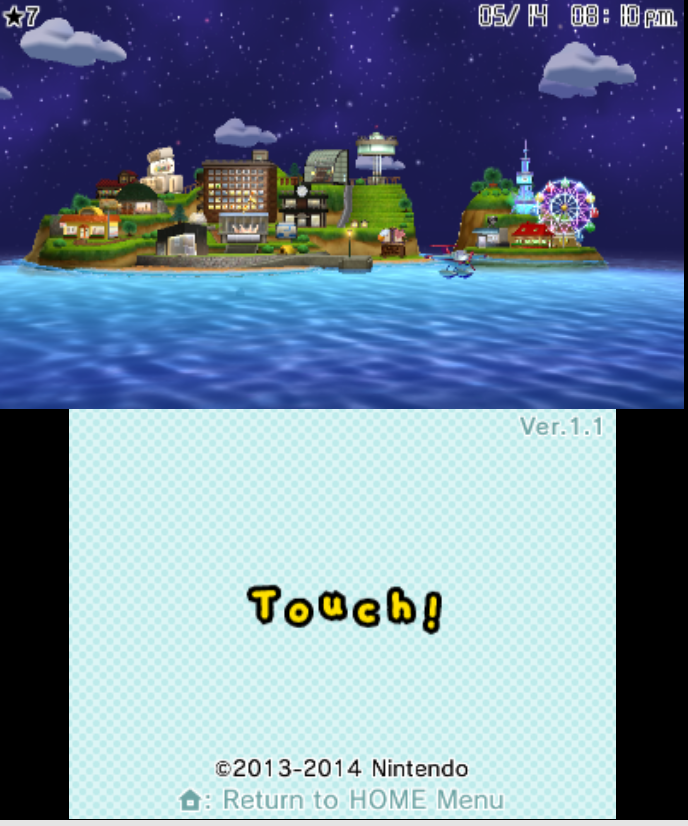
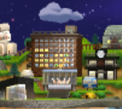
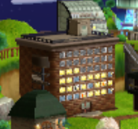

# 456xxx crush

**patches:** FUN_00556104
**purpose:** deciding crushes (i think)

- opened the game several times to only black/orange windows, no freeze
- froze on screenshots below (is that a pixel of pink or is it just me?)
- does not freeze on pink windows that are about proposals (i.e. relationships that already exist)
- when offset 0x4561ee (the first hunk), it only freezes on some pink confession windows,
  but when offset 0x456104 (the start of the function), all pink confession windows
  cause freezes
- sometimes it freezes on the white flash, sometimes on the island preview - is graphics async
  to window logic?





## hunks

```
offset: 0x4561EE
length: 0x2A

offset: 0x4567FC
length: 0x4

offset: 0x456A23
length: 0x1

offset: 0x456AC8
length: 0x4
```
